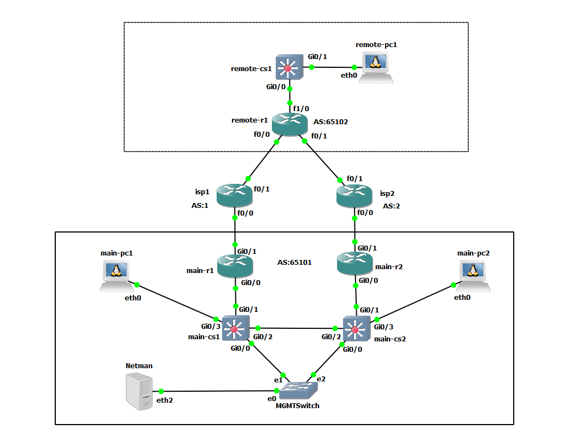

# Excercise 1: Build the Lab

# Environment
  I chose to use GNS3 for creating a virtual lab as I am most familiar with how it works. The lab is a simple network consisting of three parts. I wanted to have both layer 2 and layer 3 devices to work with in the lab. I have pre-provisioned connectivity,basic routing, and authentication on the devices so that I can gather information about the network from the network management server. I am using all Cisco based virtual images for the network devices. Thoughts on the simulated PCs - automate vlans, dhcp configuration and test connectivity via/to the PCs. 

 1. Main location - Subnet 10.10.0.0/20
    1. two managed switches
	2. two routers
	3. unmanaged "management" switch
	4. Network management ubuntu based server with tools installed: ansible, napalm, netmiko, pyntc, and git
	5. two simulated pcs
 2. Remote location - Subnet 10.10.1.0/20
    1. one managed switch
	2. one managed router
	3. one simulated pc
 3. Provider routers that interconnect the main location to the remote location.
    1. ISP1 - Subnet 10.42.1.0/24
    2. ISP2 - Subnet 10.42.2.0/24

# Physical Network Diagram

# Layer 3 Network Diagram
 

# GNS3 configuration
I am using GNS3 version 2.1.3 with the separate GNS3 server VM. The GNS3 server VM runs in VMWARE Player 12.5. The network manager server also runs in VMWARE Player 12.5. I had to create a loopback device on my laptop (Windows 10) and bridge that to a VMWARE virtual nic (vmnet2). I then created another nic on the GNS3 VM and attached it to vmnet2. I created a "cloud" object in GNS3 that runs on the GNS3 server VM and the cloud object is connected to the third interface on the VM which bridges a  device running inside the GNS3 server VM to the network manager server VM running in parallel to the GNS3 server VM.

# What I have learned so far. 
One thing I would like to do next time is connect the network management server to "OOB" on all of the devices and "provision" the more of network with a tool. I spent a lot of time getting the network up and working and I feel that the time could have been better spent getting the automation working. In real life we don't always have OOB everywhere so this lab IS somewhat closer to what I have to deal with in everyday life. I also started to use the "network automation" docker image appliance from the GNS3 marketplace but found it lacking in some respects - it did not come with git! I am not that familiar with docker and did not want to go down the road of reworking the docker image or creating a docker image from scratch so I built an Ubuntu linux VM and put all of the tools there that I would need thus far. I could also add/change easily if desired.